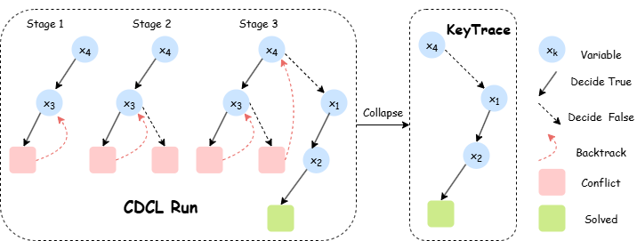

<p align="center">
  <h1 align="center"><em>ImitSAT</em>: Boolean Satisfiability via Imitation Learning</h1>
  <!-- <br /> -->
  <div align="center">
    <strong>Zewei Zhang</strong>
    &nbsp;&nbsp;
    <strong>Huan Liu</strong>
    &nbsp;&nbsp;
    <strong>Yuanhao Yu</strong>
    &nbsp;&nbsp;
    <a href="https://www.ece.mcmaster.ca/~junchen/"><strong>Jun Chen</strong></a>
	&nbsp;&nbsp;
    <a href="https://xuxy09.github.io/"><strong>Xiangyu Xu</strong></a>
  </div>

<div align="center">
<br>
    <a href="https://arxiv.org/abs/2404.07206"></a>
    <a href="https://colab.research.google.com/drive/1NuLn_Umt57TLEGueQj-ff8-yaM8BQiCy?usp=sharing"></a> 
    <a href="https://drive.google.com/drive/folders/12WR143YGghZ3zD4-4haOMv2tixAbfhZe?usp=sharing"></a>
    <a href="https://drive.google.com/file/d/1ePaWFlMpfIKPnc31abwC_UbKDFMJyy4o/view?usp=sharing"></a>
</div>


<div align="center">
    
</div>

We propose ImitSAT, a branching policy for conflict-driven clause learning (CDCL) solvers based on imitation learning for the Boolean satisfiability problem (SAT). Unlike previous methods that predict instance-level signals to improve CDCL branching indirectly, or rely on reinforcement learning and insufficient CDCL information to enhance branching, ImitSAT learns from expert KeyTrace that collapses a full run into the sequence of surviving decisions. Replaying a KeyTrace on the same instance is nearly conflict-free, providing dense decision-level supervision and directly reducing propagations—the dominant contributor to wall-clock time. This prefix-conditioned supervision enables ImitSAT to reproduce high-quality branches without exploration, yielding faster convergence, stable training, and seamless integration into CDCL. Extensive experiments demonstrate that ImitSAT reduces propagation counts and runtime, outperforming state-of-the-art learned approaches. 

<!-- ## Table of Contents
- [Environment](#environment)
- [Data Pipeline](#data-pipeline)
- [Train ImitSAT](#train-imitsat)
- [Run ImitSAT (MiniSAT integration)](#run-imitsat-minisat-integration)
- [Evaluate (MRPP & Win@1%)](#evaluate-mrpp--win1)
- [Results (Examples)](#results-examples)
- [Reproducibility Notes](#reproducibility-notes)
- [Acknowledgements](#acknowledgements)
- [Citation](#citation) -->

<!-- <a id="environment"></a> -->
## 🔧 Environment

```bash
conda create -n imitsat python=3.10 -y
conda activate imitsat
pip install -r requirements.txt
```

> If you need a CUDA‑specific JAX wheel, install it per the official JAX instructions for your CUDA/CuDNN.

---

## 📦 Data Pipeline
We provide the test set in this repository and the training dataset: <a href="https://drive.google.com/drive/folders/12WR143YGghZ3zD4-4haOMv2tixAbfhZe?usp=sharing"></a>. If you want to generate your own dataset, you can use the scripts below.


### 1) Generate synthetic CNF buckets

Each line is a CNF in a compact DIMACS‑like format (clauses end with `0`).

```bash
python -m generate_dataset.gen_cnf_buckets \
       --vars-min 5 --vars-max 15 --samples 2000000 \
       --out-dir ./dataset/train_raw/
```

### 2) Extract KeyTrace

Produces gzipped JSONL files with records `{cnf, n_v, n_c, key_trace}`.

```bash
python -m generate_dataset.extract_keytrace  \
       --raw-dir ./dataset/train_raw/ \
       --out-dir ./dataset/train/   --workers 16
```

---

## 🏋️ Train ImitSAT
Provide a config (paths, model hyperparameters, optimizer, etc.).  
Checkpoints (`ImitSAT_epoch*.npz` / `ImitSAT_step*.npz`) and the tokenizer are saved to the configured output directory.

```bash
python  train_ImitSAT.py  --config ./model_config/ImitSAT_config.json
# (Optional) resume from a folder containing ImitSAT.npz and tokenizer/
python  train_ImitSAT.py  --config ./model_config/ImitSAT_config.json  --resume_dir ./model_ckpt/
```

---

## 🚀 Run ImitSAT
We evaluate the ImitSAT and related methods on Colab with A100:  <a href="https://colab.research.google.com/drive/1NuLn_Umt57TLEGueQj-ff8-yaM8BQiCy?usp=sharing"></a>.


**Expected model layout**

```
model_ckpt/
  ImitSAT.npz
  tokenizer/
model_config/
  ImitSAT_config.json
```

> Note. Results can differ slightly across GPUs because JAX compiles with XLA to hardware‑specific kernels. Differences in kernel fusion and reduction order can result in small numerical changes that may affect a few branching decisions. We report benchmarks on **Colab A100**.
---

## 📊 Evaluate (MRPP & Win@1%)
Prints **MRPP** $\tilde r$ (↓) and **Win@1%** W<sub>1%</sub> (↑).
```bash
python ./analysis/metrics_mrpp_win.py
# (by default scans ./output/imitsat/*.json)
```

---

## 🧽 (Optional) Normalize DIMACS

If you have public datasets with messy DIMACS (extra `%`/`0`, broken lines), normalize them:

```bash
python ./utils/reformat_dimacs.py \
       --input_dir ./dataset/public_dataset/raw \
       --output_dir ./dataset/public_dataset/normalized
```

---

## 🙏 Acknowledgements
This repository builds on prior work, including [**MiniSAT**](https://github.com/niklasso/minisat) and[**Perceiver‑AR**](https://github.com/google-research/perceiver-ar). We also drew comparisons from [**SATformer**](https://github.com/zshi0616/iccad_SATformer) and [**Graph-Q-SAT**](https://github.com/NVIDIA/GraphQSat).   In addition, we rely on excellent open‑source libraries such as `pysat`, `jax`, and `haiku`. We are grateful to the authors and maintainers of these projects.

---

## 📚 Citation

```bibtex
@misc{imitSAT2025,
  title  = {Boolean Satisfiability via Imitation Learning},
  author = {Zewei Zhang and Huan Liu and Yuanhao Yu and Jun Chen and Xiangyu XU},
  year   = {2025},
  eprint={},
  archivePrefix={arXiv},
  url={}, 
}
```
